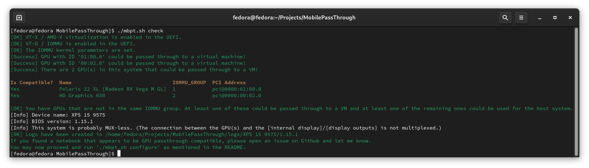

# MobilePassThrough

## Introduction
The goal of this project is to make GPU passthrough on notebooks as easy and accessible as possible.  
To achieve that goal I have written a collection of scripts that:

### On the host system (Linux):

- [x] Automatically install the required dependencies
- [x] Automatically configure the kernel parameters to support GPU passthrough
- [x] Automatically install Bumblebee and the Nvidia GPU driver
- [x] Automatically check if and to what extend your device is compatible with GPU passthrough.
- [x] Automatically create and configure a virtual machine that is fully configured for GPU passthrough.
- [x] Automatically download the Windows 10 installation iso from Microsoft.
- [x] Automatically compile/set up LookingGlass

### In the virtual machine (Windows)

- [x] Automatically install the required drivers (ivshmem and other vfio drivers)
- [x] Automatically compile/install/start LookingGlass
- [x] Automatically configure the network
- [x] Automatically set up RDP
- [x] Automatically install and autostart LookingGlass

And there is also a lot of advanced stuff that I managed to fully automate, like:

 - [x] Automatically rebinding the dGPU to the vfio drivers (when the VM starts)
 - [x] Automatically rebinding the dGPU to the nvidia drivers (when the VM exits)
 - [x] Automatically creating a vGPU from the iGPU (when the VM starts) to allow sharing the iGPU with the VM (aka "mediated iGPU passthough" using GVT-g) (So your VM can safe a ton of battery life when it doesn't need the dGPU.)
 - [x] Automatically remove the vGPU (when the VM exits)

## Limitations

- The project is currently only compatible with Fedora 29 and Fedora 30 out of the box.
- This project currently only supports Windows 10 x64 VMs. (For other Windows versions you have to figure out the driver installation etc. on your own.)
- Your device needs to have an Intel CPU and an Nvidia GPU. (Although the compatibility-check script should actually work on any hardware. The other scripts however would need adjustments to run on other distributions.)
- Expect bugs. I have only tested this on a handful of devices and I have constantly changed the scripts without testing everything every time.
- VBIOS ROM extraction will likely fail because the nvidia kernel module is loaded. (You may not need the VBIOS ROM though.)
- This project takes a couple of measures to circumvent Nvidia's infamous Error 43, which you normally see in the Windows device manager when you pass a mobile Nvidia GPU through to a Windows VM. But even with these measures, some systems will still show Error 43.

## Screenshot of the compatibility-check script


## How to use?

### BIOS/UEFI configuration
- On some (gaming) notebooks the integrated graphics of the CPU are disabled. If that is the case for you, you need to enable them in the BIOS/UEFI.
  (Some vendors actually disable the CPU integrated GPU completely and don't offer UEFI options to enable it. Modding your BIOS could potentially fix that. See the "UEFI / BIOS modding" for more information on that.)
- You might also have to disable secure boot in the UEFI.
  (Mainly to use Nvida's proprietary driver on Linux while your VM is not running.)
- It might also be necessary to disable fastboot in the UEFI.

### Installation and configuration
- Downlaod and install [normal Fedora](https://getfedora.org/) or the [KDE version](https://spins.fedoraproject.org/kde/)
- Make sure to crate a user account (with administrator rights) when you are asked
- Open a terminal and install git by typing the following, pressing enter after each line:

``` bash
sudo dnf install git -y # Install git
git clone https://github.com/T-vK/MobilePassThrough.git # Clone the project
cd MobilePassThrough # Enter the project directory
sudo ./setup.sh # Dependency installation; kernel param config; bumblebee / nvidia driver installation
```

- Reboot your system
- Open a new terminal and type:

``` bash
cd MobilePassThrough # Enter the project directory
sudo ./compatibility-check.sh # Check if your system is compatible
# If the script says that your system is compatible you may succeed:
./generate-vm-config.sh # Create a config file
# Follow the instructions in your terminal! Then continue:
./generate-helper-iso.sh # Generate an iso file containing tools, installers, drivers and a Batch script that we need later
```

### Installation of Windows 10 in the VM

- Open TWO terminals, in the first one type:
``` bash
cd MobilePassThrough # Enter the project directory
sudo ./start-vm.sh # Start the VM for the first time
# Make sure you didn't get any critical errors
```

- In the second one quickly type:
``` bash
spicy -h localhost -p 5900
```
- window should appear giving a GUI to interact with the VM and it will say something like "press any key to boot from cd now".
- Press any key quickly!
- The Windows installer will show. Go through it, it should be simple enough.
- During the installation you may have to manually pick a disk driver for the virtual disk to be recognized. Click "Browse" and select `?:\viostor\w10\amd64\` from the `virtio-win` CD Drive.
- You should set a password for your user account otherwise you'll have trouble with RDP.
- Once Windows is installed, go to the virtual CD drive that contains the start.bat file and right-click it and click `Run as administrator` and make sure you didn't get any errors.
- Reboot the VM.

In the future when you want to start the VM, you can open 2 terminals:

- In the first one run:
``` bash
cd MobilePassThrough # Enter the project directory
sudo ./start-vm.sh
```

- Open Remmina and connect to `rdp://192.168.99.2`

- Then in the second terminal run:
``` bash
cd MobilePassThrough # Enter the project directory
./LookingGlass/client/build/looking-glass-client`
```

## Requirements to get GPU-passthrough to work on mobile

- [ ] Device needs to be (mostly) compatible with Linux.  
    Note: most Laptops should be these days  

- [ ] At least two GPUs (typically Intel's iGPU and an Nvidia GPU)  
    Note: If you have Thunderbolt 3, you might be able to use an eGPU. See: https://egpu.io  
    Note2: Theoretically it's possible to get this to work with only one GPU, but then you wouldn't be able to use your host system directly while running the VM, not the mention like 50 other issues you'll run into.  

- [ ] CPU needs to support `Intel VT-x` / `AMD-V`  
    Note: Unless your notebook is like 10 years old, the CPU should support this.    
    Note2: If it supports `Intel VT-d` / AMD's `IOMMU` it should automatically also support `Intel VT-x` / `AMD-V`.    
- [ ] Chipset to support `Intel VT-x` / `AMD-V`    
    Note: Unless your notebook is like 10 years old, it should support this.    
    Note2: If it supports `Intel VT-d` / AMD's `IOMMU` it should automatically also support `Intel VT-x` / `AMD-V`.    
- [ ] BIOS/UEFI option to enable `Intel VT-x` / `AMD-V` must exist or it has to be enabled    
    Note: Unless your notebook is like 10 years old, it should support this.    
    Note2: If it supports `Intel VT-d` / AMD's `IOMMU` it should automatically also support `Intel VT-x` / `AMD-V`.    
    Possible workaround: Modding your BIOS/UEFI using tools like UEFITool, AMIBCP etc.  (See "UEFI / BIOS modding" below)   

- [ ] CPU needs to support `Intel VT-d` / AMD's `IOMMU`  
    Note: If you have an Intel CPU, you can [check if it's in this list](https://ark.intel.com/Search/FeatureFilter?productType=processors&VTD=true&MarketSegment=Mobile).  
- [ ] Chipset to support `Intel VT-d` / AMD's `IOMMU`  
    Note: If your CPU/chipset is from Intel, you search it in [this list](https://www.intel.com/content/www/us/en/products/chipsets/view-all.html) to check it it supports VT-d.  
- [ ] BIOS/UEFI needs to support `Intel VT-d` / AMD's `IOMMU`  
    Possible workaround: Modding your BIOS/UEFI using tools like UEFITool, AMIBCP etc. (See "UEFI / BIOS modding" below)  

- [ ] When using an iGPU + dGPU setup, the iGPU needs to be enabled or the BIOS/UEFI needs to have an option to do so.  
    Possible workaround: Modding your BIOS/UEFI using tools like UEFITool, AMIBCP etc. (See "UEFI / BIOS modding" below)   

- [ ] The GPU you want to pass through, has to be in an IOMMU group that doesn't have other devices in it that the host system needs.  
    Possible workaround: You might be able to tear the groups further apart using the ACS override patch, but it's no magic cure, there are drawbacks.  

- [ ] When using an Nvidia dGPU for the passthrough, you might have to patch your GPU VBIOS ROM using [NVIDIA-vBIOS-VFIO-Patcher](https://github.com/Matoking/NVIDIA-vBIOS-VFIO-Patcher) or the OvmfPkg using [arne-claey's OvmfPkg patch](https://github.com/jscinoz/optimus-vfio-docs/issues/2) or patch the Nvidia driver using [nvidia-kvm-patcher](https://github.com/sk1080/nvidia-kvm-patcher).  
    Note: Loading modded VBIOS ROMS should be pretty safe as the ROM gets deleted after every GPU shutdown anyway afaik.  
    Note2: The `nvidia-kvm-patcher` is pretty buggy and very outdated and you'll most likely not get it to work especially with recent drivers. I haven't had any success with any driver so far.  
    Note3: I haven't been able to get arne-claey's OvmfPkg patch to build on my Fedora machine so far.  
    Note4: I haven't been able to get `NVIDIA-vBIOS-VFIO-Patcher` to work yet either.  


The last point really seems to be the biggest hurdle, but since it's just a software issue, it should be possible to get this to work.  
We just need some smart people to fix one of these patches or to make them more accessible.


## Potentially useful hardware tools

[USB Programmer for BIOS/UEFI flashing or unbricking](https://www.aliexpress.com/item/-/32957821101.html)
EDID Dummy Plugs for [HDMI](https://www.aliexpress.com/item/-/32919567161.html) and [Mini DisplayPort](https://www.aliexpress.com/item/-/32822066472.html) can be used to make your dGPU write to the framebuffer so that oyu can use [Looking Glass](https://looking-glass.hostfission.com/). (Your dGPU needs to be connected to your external HDMI or Display Port for that to work though... [This may be possible with some UEFI/BIOS modding](https://github.com/jscinoz/optimus-vfio-docs/issues/2#issuecomment-471234538).)

## List of tested GPU-passthrough compatible devices

Check out: https://gpu-passthrough.com/

## UEFI / BIOS modding

By modding your BIOS/UEFI, you can make features available and change settings that are hidden or non-existent by default. For example: show VT-d settings, show secure boot settings, show muxing related settings and much more. There is a good collection of modding tools on [this site here in the BIOS / UEFI tools section](https://forums.tweaktown.com/gigabyte/30530-overclocking-programs-system-info-benchmarking-stability-tools-post284763.html#post284763).

# Configuring the Windows VM manually

 - (During the installation you may have to manually pick a disk driver for the virtual disk to be recognized. Click "Browse" and Select ?:\viostor\w10\amd64\ from the virtio-win CD Drive.)
 - After the installation open the Windows Device Manager and manually install missing drivers by rightclicking the devices with a warning symbol (not the graphics card though) -> "Update Driver" -> "Browse my computer for driver software" -> Click "Browse..." -> Select the virtio-win CD Drive -> Click OK -> Click Next.
 - If under "System devices" you have a device called "PCI standard RAM Controller", then you have to install a different driver for that by downloading [these drivers](https://fedorapeople.org/groups/virt/virtio-win/direct-downloads/upstream-virtio/virtio-win10-prewhql-0.1-161.zip), extracting them and then do the previous step for this device, but browse to the extracted folder instead and select that instead. The device should then show up as "IVSHMEM Device".
 - I also advice you to enable Widnows Remote Desktop ("Allow remote connections to this computer" in the System Properties)
 - For RDP to work properly you might have to set up a password for your Windows user
 - I'd also advice you to disable UAC by setting "HKEY_LOCAL_MACHINE\SOFTWARE\Microsoft\Windows\CurrentVersion\Policies\System\EnableLUA" to 0 because the propts are hidden to Looking Glass.
 - Set a static IP for the virtio (TAP) Ethernet adapter in Windows. E.g. 192.168.99.2
 - If you want to use Looking Glass download and install the [Microsoft Visual C++ 2017 Redistributables Package](https://download.microsoft.com/download/8/9/D/89D195E1-1901-4036-9A75-FBE46443FC5A/VC_redist.x64.exe) and download the [latest release of the Looking Glass host](https://github.com/gnif/LookingGlass/releases)
 - I'd also put Looking Glass into the startup folder so that it runs automatically every time.


## Credits

Credits to Wendell from Level1Techs for his GPU passthrough guides/videos and Misairu-G for his Optimus laptop dGPU passthrough guide.
Without them I would have never even thought about creating this project. Thank you so much!!
